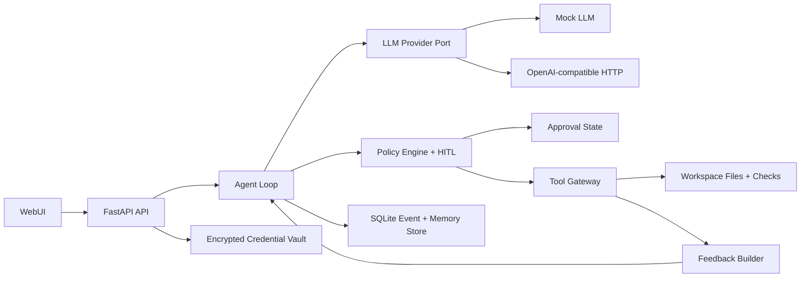

# SafePatch Harness SPEC

## 1. 问题陈述

SafePatch Harness 是一个面向课程 Project A 的 coding agent harness。它不是基于 LangChain AgentExecutor、AutoGen、CrewAI、LlamaIndex agent runner 等高层 agent 框架的封装，而是自己实现 agent 主循环：组织上下文、调用 LLM、解析动作、执行工具、回灌反馈、治理拦截、人工审批和停机判断。

目标用户是需要让 LLM 在本地代码仓库中执行小规模修复任务的学生和开发者。核心价值不是“让模型写代码”，而是把模型限制在可审计、可回放、可测试的工程边界内：它能读文件、提出补丁、运行配置好的检查，并在危险动作前暂停等待人工审批。

30 秒描述：用户给出一个仓库路径和修复任务，SafePatch Harness 会在受限工作区内驱动 LLM 多轮行动。所有动作先经过确定性策略检查；危险命令、路径逃逸、敏感文件和过大改动会被拒绝或暂停审批。测试失败会作为结构化反馈进入下一轮，直到检查通过、预算耗尽或用户停止。

## 2. 用户故事

1. 作为开发者，我希望在本地仓库中发起一个“修复失败测试”的任务，以便 agent 能读取相关文件、生成补丁并运行测试。
2. 作为开发者，我希望所有文件写入都只能发生在我允许的仓库目录内，以防路径逃逸或误改系统文件。
3. 作为开发者，我希望危险 shell 命令被确定性拦截，并在可审批场景下暂停等待我确认，以便我保留最终控制权。
4. 作为开发者，我希望测试、lint 或类型检查失败能被解析并反馈给下一轮 LLM，以便 agent 根据客观信号修正，而不是自我感觉完成。
5. 作为开发者，我希望使用 mock LLM 离线复现完整 agent 循环，以便在没有真实 API key 和网络的情况下验证核心机制。
6. 作为开发者，我希望通过 WebUI 查看运行时间线、待审批动作、测试结果和最终 diff，以便快速判断 agent 做了什么。
7. 作为开发者，我希望 API key 通过安全流程录入、更新、清除，并且状态查看不回显明文，以避免凭据泄露。

## 3. 领域与机制设计

### 3.1 工具和动作

交付产物只允许执行以下动作类型：

- `read_file`：读取工作区内文本文件，限制最大字节数。
- `list_files`：列出工作区内匹配路径，默认忽略 `.git`、依赖目录、构建产物和敏感目录。
- `search_text`：在允许目录内搜索文本。
- `apply_patch`：用上下文校验的统一 diff 修改文件；上下文不匹配时整体失败，不产生部分写入。
- `run_check`：运行项目配置中声明的测试、lint、类型检查命令。
- `remember`：保存项目约定、用户决策、失败摘要等记忆。
- `finish`：声明完成、失败或需要人工输入。

动作由 LLM 输出结构化 JSON，后端用 Pydantic schema 解析。解析失败不会执行任何动作，只会把错误作为反馈回灌。

### 3.2 客观反馈信号

反馈信号由代码生成，不依赖 LLM 自检：

- 命令退出码、stdout/stderr 摘要、超时状态。
- pytest / npm test 等检查输出中的失败摘要。
- patch 应用失败原因：路径非法、上下文不匹配、超出 diff budget、触发审批。
- 策略拦截原因：deny、requires_approval、allowed。

反馈会以结构化 `ToolResult` 进入下一轮上下文。mock LLM 测试必须能断言：第一次补丁导致检查失败后，第二轮上下文包含失败摘要，mock LLM 因此选择不同动作。

### 3.3 危险动作和治理边界

治理是本项目主贡献维度。策略引擎以确定性代码实现，不写成提示词。

危险动作分类：

- 永久拒绝：路径逃逸、符号链接逃逸、访问 `.env` / key 文件、删除仓库外文件、网络发布、git push、凭据回显、`rm -rf` / `del /s` / `format` 等破坏性命令。
- 需要审批：超出 diff 行数预算、修改依赖锁文件、运行非默认检查命令、修改 CI / Docker / 凭据相关文件。
- 自动允许：读取普通源码、搜索文本、应用预算内补丁、运行项目配置声明的检查命令。

关键规则：

- 所有路径先 normalize，再校验必须位于 workspace root 内。
- 执行命令使用 argv 数组，不通过 shell 字符串执行。
- `run_check` 只能运行配置文件中声明的命令。
- 一次人工审批只授权一个 action id，不能复用到其它动作。
- agent 暂停审批时主循环必须停止推进，直到用户批准、拒绝或取消。
- 每个 run 有 step、时间、失败次数、diff 行数预算，达到预算即停止。

### 3.4 记忆

记忆不是把完整历史塞回上下文，而是保存可复用的短事实：

- 项目约定：测试命令、代码风格、受保护目录。
- 用户决策：曾经拒绝的动作、审批偏好。
- 失败摘要：常见失败原因和修复后的结论。
- 运行结果：每次 run 的最终状态、相关文件和检查摘要。

记忆存储在 SQLite 中，按 project id 和 tag 检索。每轮上下文只注入与当前任务关键词、相关文件和最近失败相关的少量记忆。

### 3.5 重点维度

本项目重点做深“治理护栏 + HITL 状态机”。原因是该维度最能体现 harness 与 prompt wrapper 的区别：即使移除真实 LLM，策略判断、审批暂停、一次性授权、拒绝反馈、停机行为都可以用 mock LLM 和单元测试确定性验证。

## 4. 功能规约

### 4.1 Agent 主循环

输入：run id、仓库路径、用户任务、LLM provider、策略配置、预算。

行为：

- 构建上下文：系统边界、用户任务、工作区摘要、相关记忆、上一步工具反馈。
- 调用 LLM provider，得到单个结构化 action。
- schema 校验 action；失败则产生 parse error feedback。
- 调用 policy engine 评估 action。
- deny 时不执行工具，反馈拦截原因。
- requires_approval 时记录 pending action 并暂停 run。
- allow 时 dispatch 到 tool gateway 执行。
- 执行结果写入 event log，并参与下一轮上下文。
- 满足 finish、pass、预算耗尽、用户取消或 fatal error 时停止。

输出：run 状态、事件列表、最终摘要、最终 diff、检查结果。

边界条件：LLM 输出非 JSON、action 未知、工具超时、patch 冲突、数据库写入失败、用户拒绝审批。

### 4.2 工具网关

输入：已通过策略的 action。

行为：

- 文件工具只在 workspace root 内运行。
- patch 工具必须做上下文匹配，失败不写入。
- 检查工具只运行声明式 allowlist 命令。
- 所有工具结果统一为 `ToolResult`。

输出：success、observation、structured metadata。

错误处理：路径非法、文件过大、编码不可读、命令超时、命令不存在、patch 不匹配。

### 4.3 策略与审批

输入：action、workspace policy、run budget、当前审批状态。

行为：

- 按 deny / requires_approval / allow 返回决策。
- 审批 action 必须生成稳定 action id 和 rationale。
- WebUI 提供 approve / reject；approve 后只执行原 action。
- reject 结果作为反馈进入下一轮。

输出：policy decision、reason、required approval detail。

### 4.4 反馈闭环

输入：工具结果、策略结果、检查输出。

行为：

- 提取失败摘要和相关文件。
- 把失败分类为 parse_error、policy_denied、approval_rejected、patch_conflict、check_failed、timeout、success。
- 下一轮上下文包含短摘要和机器可读状态。

输出：feedback block。

### 4.5 凭据管理

输入：用户输入的 API key、主密码。

行为：

- 首次运行引导用户通过 WebUI 或 CLI 安全录入 key。
- key 用主密码派生密钥加密后存储在本地 encrypted vault 文件或 SQLite blob 中。
- 状态接口只返回是否存在、更新时间、provider，不返回明文。
- 支持 update、delete、lock。
- 日志、事件、错误信息、API 响应必须经过 secret redaction。

输出：credential status，不含明文。

边界条件：主密码错误、vault 损坏、provider 未配置、用户选择 demo mode。

### 4.6 WebUI

输入：用户在浏览器中创建 run、配置 workspace、查看审批。

行为：

- 首页是工作台，不做营销页。
- 展示 run 列表、当前 run 状态、事件时间线、待审批动作、测试输出摘要、最终 diff。
- 提供创建 run、取消 run、批准 / 拒绝动作、配置凭据状态的操作。
- demo mode 使用内置 sample repo 和 mock LLM，不要求真实 key。

输出：可访问 WebUI。

### 4.7 配置

输入：`safepatch.yml` 或 WebUI 配置。

字段：

- workspace root
- allowed checks
- denied paths
- protected paths
- diff line budget
- step / time / failure budget
- provider name
- demo mode

错误处理：配置缺失时使用安全默认值；不合法配置启动失败并报告具体字段。

## 5. 非功能性需求

### 5.1 安全

威胁模型：

- LLM 可能输出危险命令或试图读取敏感文件。
- LLM 可能把 API key 写进日志、patch 或反馈。
- 用户误配置 workspace root 造成路径逃逸。
- WebUI 可能被远程访问后触发本地代码执行。
- patch 可能通过符号链接或路径穿越写到仓库外。

对策：

- 默认绑定 `127.0.0.1`，公网 demo 只允许 mock LLM 和 sample repo。
- 命令 allowlist，且使用 argv 执行。
- path normalization、workspace containment、symlink resolution。
- sensitive path denylist 和 secret redaction。
- encrypted vault，不回显 key。
- 审批状态机与一次性 action id。
- 所有核心机制有 mock LLM 单测。

### 5.2 性能

单个 run 默认最多 20 steps、10 分钟、每步工具超时 30 秒。文件读取默认最多 200KB，搜索结果默认最多 50 条。WebUI 时间线增量刷新或 SSE，不阻塞页面。

### 5.3 可用性

WebUI 优先服务重复使用场景：左侧 run 列表，中间事件时间线，右侧审批与检查结果。所有危险动作必须显示原因、目标和可预期后果。demo mode 必须一键可运行。

### 5.4 可观测性

所有 run 写入事件表：action、policy decision、tool result、feedback、state transition、human decision。日志必须脱敏。测试中验证敏感值不会出现在事件和日志里。

## 6. 系统架构

## 7. 数据模型

- `Project`：id、name、workspace_root、config、created_at。
- `Run`：id、project_id、task、status、provider、budget、created_at、updated_at、finished_at。
- `Event`：id、run_id、sequence、type、payload_json、created_at。
- `Action`：id、run_id、step、type、payload_json、policy_status、created_at。
- `Approval`：id、action_id、status、decision_by、reason、created_at、decided_at。
- `Memory`：id、project_id、kind、tags、content、source_run_id、created_at。
- `CredentialStatus`：provider、has_key、updated_at、vault_path，不包含 key 明文。

约束：event sequence 在 run 内递增；approval action_id 唯一；workspace_root 必须是绝对路径；payload 写入前执行脱敏。

## 8. 凭据与分发设计

凭据：

- 默认使用 encrypted vault：主密码经 Argon2id 派生密钥，API key 使用 AES-256-GCM 加密。
- `.env` 只允许本地开发作为显式 fallback，必须在 README 说明明文风险。
- WebUI / CLI 状态只显示 provider、是否配置、更新时间。
- `AGENT_LOG.md` 和事件日志不得包含真实 key。

分发：

- 采用 Docker 容器分发，单条 `docker build` 和单条 `docker run` 启动。
- 容器默认 demo mode，无需真实 key。
- 本地真实模式通过 volume 挂载 workspace 和 data 目录。
- CI 包含 `unit-test` job，并构建 Docker image。
- 公网部署只开放 demo mode，不执行用户任意仓库代码。

## 9. 技术选型与理由

- Python 3.12：标准库和测试生态成熟，便于实现文件、patch、子进程、SQLite。
- FastAPI + Pydantic：适合结构化 action schema、API 和 WebUI 后端。
- SQLite：本地单用户事件与记忆足够可靠，部署简单。
- pytest：方便 mock LLM 驱动确定性测试。
- httpx：只用于真实 LLM 单次 HTTP 调用，不引入 agent 框架。
- Vanilla HTML/CSS/JS：降低前端构建复杂度，保留可访问 WebUI；界面按 Open Design 的工作台式、信息密集、低装饰原则执行。当前会话未安装 Open Design skill，后续若可用则补充 UI 过程记录。
- Docker：满足分发和冷启动运行要求。

## 10. 验收标准

- mock LLM 下可离线运行完整主循环。
- 单测覆盖工具分发、策略拦截、反馈回灌、记忆写读、停机条件。
- 危险命令和路径逃逸被确定性拒绝。
- 需要审批的动作使 run 暂停，暂停时不继续下一步。
- 一次审批只执行对应 action，重复 approve 不会重复执行。
- 注入一次测试失败后，下一轮 LLM 上下文包含失败摘要，mock LLM 改变动作。
- key 不出现在 Git、日志、事件、API 响应和错误输出。
- `make test` 一键运行测试。
- `.gitlab-ci.yml` 包含 `unit-test` job 且可通过。
- Docker image 可启动 WebUI。
- demo mode 可在无真实 API key 情况下展示机制演示。

## 11. 风险与未决问题

- 课程要求必须使用 Superpowers；当前 Codex 会话未暴露可调用的 Superpowers 插件能力，需要安装后补充过程证据。
- 冷启动验证要求“不同 agent 类型”；当前只能先准备 SPEC / PLAN，正式实现前必须由不同 agent 执行 1-2 个 task 并记录反馈。
- 公网 WebUI 不能运行用户任意命令，因此部署版必须限制为 demo mode。
- Windows 与 Linux 路径规则不同，路径安全测试必须覆盖两类风险。
- patch 应用需要保证原子性，不能出现部分成功。
